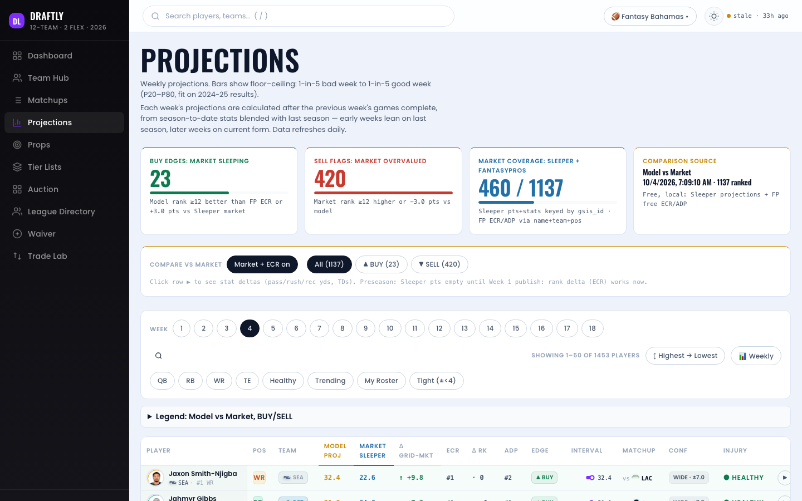
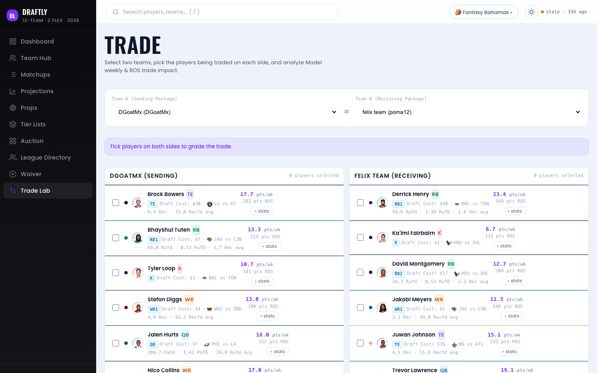

# Draftly


Weekly fantasy football projections, start/sit calls, matchup simulations, trade evaluation, and auction drafting. A web app plus the research pipeline behind it.

Live: https://draftly-liamfelixb-9782s-projects.vercel.app



## Accuracy

Frozen evaluation numbers from [research/docs/ACCURACY.md](research/docs/ACCURACY.md) (stat projector, 2024–2025 weeks 4–18, n=10,351, standard scoring):

| Metric | Value |
| --- | --- |
| MAE | 4.563 points per player-week |
| Correlation | 0.648 |
| Pairwise start/sit | 74.1% |

Projections are graded every week against nflverse actuals; graded history accumulates in `apps/fantasyhub/data/grades/weekly.json`.

## Layout

```
apps/fantasyhub/   deployed app: serverless API, static UI, projection data, pytest suite
research/          projection pipeline: PBP features, XGBoost residual models,
                   conformal intervals, backtests, weekly grading
                   (Vite UI source in research/hub/)
```

Assembled from the project's two original repositories via `git subtree`, one import commit per tree; full development history stays searchable in those two (kept as archives, see [docs/adr/001-canonical-paths.md](docs/adr/001-canonical-paths.md)).



## Running

Tests (same commands CI runs):

```bash
cd apps/fantasyhub
pip install -r requirements.txt -r requirements-ml.txt -r requirements-dev.txt
python -m pytest api/ scripts/ -q

cd research
pip install -e . -r requirements.txt
SLEEPER_LEAGUE_ID=test pytest -q
```

Local app — API on :8000, proxy on :8002, UI on :8001:

```bash
bash research/hub/start.sh
```

CI runs both suites on every push; a daily GitHub Actions cron regenerates projections.

## License

MIT — see LICENSE.
